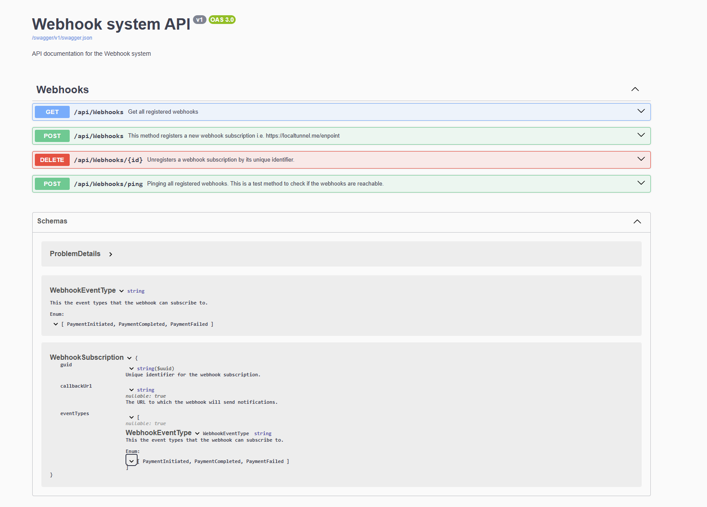

# Webhook System
This project provides a simple webhook registration system with endpoints for registering, unregistering, and testing webhooks.

The webhook system allows clients to subscribe and receive real-time updates for specific events via webhooks.
---
## Features
- **Register Webhooks**: Add a webhook with a callback URL and event types.
- **Unregister Webhooks**: Remove a webhook using its unique identifter.
- **Ping Webhooks**: Test all registerd webhooks by sending a test message.

---

## API Documentation
The system includes Swagger for interactive API documentation. You can use it to explore it and to test the API endpoints.

### Accessing Swagger UI
- The application is hosted on Azure and you can interact it on [Swagger UI](https://webhoob20250501214221-cad2cdb4hncsg6bu.northeurope-01.azurewebsites.net/index.html) 

- 

---

## Endpoints overview
- **URL**: 
    ```URL
        https://webhoob20250501214221-cad2cdb4hncsg6bu.northeurope-01.azurewebsites.net 
    ```
### 1. Get all registered webhooks
- **Endpoint**: `GET /api/Webhooks`
- **Description**: Get all registered webhooks.

### 2. Register a Webhook
- **Endpoint**: `POST /api/Webhooks`
- **Description**: Register a new webhook.
- **Request Body**:
  ```json
  {
    "callbackUrl": "https://example.com/webhook",
    "eventTypes": ["PaymentInitiated", "PaymentCompleted"]
  }

### 3. Unregister a Webhook
- **Endpoint**: `DELETE /api/Webhooks/{id}`
- **Description**:  Unregisters a webhook by its unique identifier.

### 4. Ping Webhooks
- **Endpoint**: `POST /api/Webhooks/ping`
- **Description**:  Sends a test message to all registered webhooks..